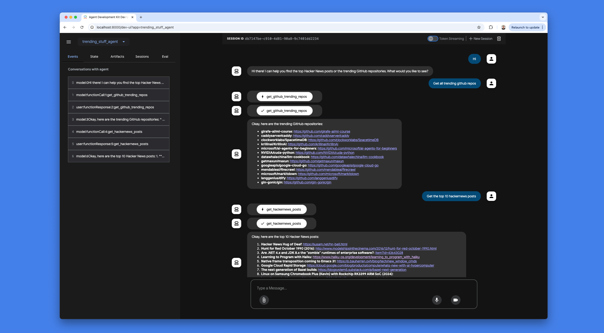

# Agent to get Hacker News posts and trending GitHub repos

A simple [Agent Development Kit](https://github.com/google/adk-python) starter repo with one agent that can get the top Hacker News posts and the trending GitHub repos.

The agent uses Gemini 2.5 with function calling to decide which tool to use.



## 1. Installation

Install ADK and helper libraries:

```bash
pip install google-adk
pip install requests beautifulsoup4
```

## 2. Configure API key

Needs a free [Gemini API key](https://aistudio.google.com/apikey).

Rename `.env.template` to `.env` and put your own API key in the `GOOGLE_API_KEY` variable.

## 3. Start the Web UI

In the root directory, run:

```bash
adk web
```
